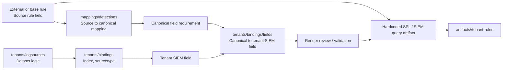

# Kiến trúc thành phần Mapping

## Phạm vi

Tài liệu này mô tả vai trò của thư mục `mappings/` trong kiến trúc hiện tại của dự án, với góc nhìn thực tế từ phạm vi làm việc của team content.

Ở thời điểm hiện tại:

- team content là bên quản lý detection content, rule logic, và field vocabulary dùng cho rule
- team deploy là bên vận hành SIEM thực tế, chịu trách nhiệm trạng thái ingest, parser, và field đang tồn tại trên SIEM
- đầu vào từ team deploy thường là SIEM đã được triển khai, đã thu thập log, và đã parse log ở một mức nào đó

Vì vậy trong version hiện tại, `mappings/` không nên bị hiểu là lớp bắt buộc giải quyết toàn bộ bài toán từ raw log đến field cuối cùng trên SIEM. Thay vào đó, nó nên được hiểu là lớp contract để team content chuẩn hóa detection field và nối detection logic với field thực tế đang có trên SIEM của từng tenant.

## Mục tiêu của `mappings/`

Trong phạm vi của team content, `mappings/` có 4 mục tiêu chính:

- tạo một vocabulary field chung để viết detection rule
- giảm phụ thuộc của rule vào naming cá nhân của người viết rule
- cho phép map detection field chuẩn sang field thực tế của tenant trên SIEM
- tạo nền cho automation render rule theo tenant, ngay cả khi hiện trạng field trên SIEM chưa được chuẩn hóa

Nói ngắn gọn:

- `rules/` trả lời "cần phát hiện hành vi gì?"
- `mappings/` trả lời "rule đang nói về field nào theo nghĩa chuẩn?"
- `tenants/` trả lời "tenant này thực tế đang có field nào và deploy vào đâu?"

## Cấu trúc folder đề xuất

Để giữ nguyên kiến trúc hiện tại của `rules/` và giảm chi phí áp dụng trong version hiện tại, phần `mappings/` nên được gom lại thành các folder phản ánh trực tiếp các mapping thực tế mà pipeline cần dùng.

Cấu trúc đề xuất:

```text
mappings/
  detections/
    network/
      firewall/
        firewall.fields.yml
tenants/
  <tenant>/
    bindings/
      ingest/
        <device>.yml
      fields/
        <device>.fields.yml
```

Nguyên tắc đặt tên:

- dùng tên folder ngắn, rõ nghĩa, thống nhất theo kiểu kebab-case
- mỗi folder phải phản ánh đúng loại mapping đang chứa
- tránh tách thêm folder trung gian nếu pipeline cuối cùng vẫn phải ghép chúng lại bằng logic ngoài

Trong mô hình này:

- `mappings/detections/`
  - chứa mapping thực tế từ `source rule field -> canonical field`
- `tenants/.../bindings/fields/`
  - chứa mapping thực tế từ `canonical field -> tenant SIEM field`

Như vậy kiến trúc folder sẽ tập trung vào:

- một lớp mapping chuẩn hóa dùng chung trong `mappings/`
- một lớp mapping triển khai thực tế theo tenant trong `tenants/`

### 1. `mappings/detections/`

Đây là lớp mapping chính của team content trong v1.0.

Vai trò:

- chuẩn hóa field của rule nguồn về canonical field
- hỗ trợ ingest rule từ nhiều nguồn khác nhau
- giảm việc phải viết mapping riêng cho từng rule nếu chúng dùng chung một field vocabulary

Lớp này nên được tổ chức theo domain giống cấu trúc của `rules/`.

Ví dụ:

```text
rules/
  detections/
    network/
      firewall/
        base/
          net_fw_rpc-to-the-internet.yml

mappings/
  detections/
    network/
      firewall/
        firewall.fields.yml
```

Ở đây:

- `rules/` vẫn giữ detection logic như hiện tại
- `firewall.fields.yml` là shared field dictionary cho toàn bộ rule firewall

### 2. `firewall.fields.yml` là shared field dictionary theo domain

File như `firewall.fields.yml` không nên bị hiểu là mapping của từng rule riêng lẻ.

Nó nên được hiểu là:

- một bộ quy tắc mapping chung cho `network/firewall`
- nơi gom các source field alias khác nhau về cùng canonical field
- lớp giải bài toán `many source fields -> one canonical field`

Ví dụ:

- `src_ip`
- `src`
- `source.ip`

Có thể cùng map về:

- `canonical.source.ip`

Cách tổ chức này phù hợp hơn với thực tế content team vì:

- nhiều rule firewall thường dùng lặp lại cùng một field vocabulary
- tránh duplication nếu mỗi rule phải có một file mapping riêng
- dễ review và maintain hơn khi cần đổi một quy ước field chung

Điều quan trọng là:

- `firewall.fields.yml` là field dictionary
- nó không thay thế requirement riêng của từng rule

Tức là file này trả lời:

- field nào có thể hiểu là canonical field nào

Nhưng không nhất thiết trả lời:

- rule nào bắt buộc field nào
- field nào optional
- field nào chỉ dùng cho output

### Metadata chung giữa `rule` và `mapping`

Để resolver chọn đúng file mapping, metadata trong file mapping nên dùng cùng ngôn ngữ với `rule`, thay vì tạo một vocabulary riêng cho mapping.

Các field chung nên được dùng là:

- `category`
- `product`
- `service`

Trong thực tế, cách biểu diễn nên bám theo cấu trúc `logsource` của rule, ví dụ:

```yaml
logsource:
  category: firewall
  product: any
  service: traffic
```

Ý nghĩa:

- `category`
  - là nhóm logsource hoặc detection chính, ví dụ `firewall`
- `product`
  - là product scope của rule hoặc mapping, ví dụ `any`, `checkpoint`, `paloalto`
- `service`
  - là dataset hoặc service logic, ví dụ `traffic`

Phần taxonomy trong folder như `network/firewall/` vẫn hữu ích để tổ chức file, nhưng metadata dùng để match giữa `rule` và `mapping` nên thống nhất với `rule.logsource.*`.

Vì vậy trong version hiện tại:

- không nên dùng `domain` như key chính để resolve mapping
- nên dùng `logsource.category`, `logsource.product`, và khi cần là `logsource.service`

### 3. `tenants/<tenant>/bindings/fields/`

Đây là lớp map từ canonical field sang field thực tế trên SIEM của từng tenant.

Vai trò:

- là source of truth cho hiện trạng field thực tế của tenant
- phản ánh khác biệt theo `tenant_id`, `siem_id`, `device_id`, và khi cần là `dataset_id`
- cho phép team deploy và team content trao đổi trên cùng một field contract nhưng không ép mọi tenant phải giống nhau

Ví dụ:

```text
tenants/
  fis/
    bindings/
      fields/
        checkpoint-fw.fields.yml
```

Trong file này có thể mô tả:

- canonical field nào map sang field nào trên SIEM của tenant
- phạm vi mapping đó đang áp cho device hoặc dataset nào

### 4. Bỏ `canonical-views/`, `siem-fields/`, và `logsources/` khỏi lớp folder chuẩn hiện tại

Trong mô hình folder mới:

- không cần giữ `canonical-views/` như một folder riêng nếu semantic field đã được thể hiện ngay trong file mapping thực tế
- không cần giữ `siem-fields/` như một folder chuẩn nếu mapping thực tế phụ thuộc tenant và device
- không xem `logsources/` là một nhánh chuẩn trong kiến trúc folder hiện tại

Nếu cần giữ dữ liệu cũ hoặc tri thức về vendor log:

- có thể giữ lại như legacy data
- hoặc chuyển dần sang một khu vực tài liệu hoặc registry phụ trợ riêng

Phần pipeline chính chỉ nên tập trung vào:

- `mappings/detections/`
- `tenants/.../bindings/fields/`

## Canonical là gì

Trong ngữ cảnh của dự án này, `canonical field` nên được hiểu là:

- bộ field chuẩn nội bộ của project
- ổn định hơn field đang tồn tại trên từng tenant
- không phụ thuộc trực tiếp vào raw log của vendor
- không phụ thuộc trực tiếp vào cách parse hiện thời của từng SIEM deployment

`canonical` không nhất thiết phải là OCSF đầy đủ 100%.

Ở v1.0, cách thực dụng hơn là:

- dùng OCSF như semantic reference
- chọn ra một tập field đủ nhỏ và đủ ổn định cho từng domain detection
- xem đó là canonical vocabulary của project

Ví dụ:

- canonical firewall field có thể là `src_ip`, `dest_ip`, `dest_port`, `protocol`, `action`
- tenant A có thể dùng `src`, `dst`, `dport`, `proto`, `act`
- tenant B có thể dùng `src_ip`, `dest_ip`, `dest_port`, `protocol`, `action`

Khi đó:

- người viết rule chỉ cần dùng canonical field
- tenant binding sẽ chịu trách nhiệm map canonical field sang field SIEM thực tế của tenant

## Rule field từ source bên ngoài

Trong thực tế, không phải mọi detection rule đi vào hệ thống đều được viết trực tiếp bằng canonical field của project.

Ví dụ:

- rule lấy từ Sigma
- rule lấy từ Elastic Security
- rule lấy từ content cũ trong nội bộ

Các rule này thường mang theo field vocabulary riêng của nguồn gốc. Vì vậy ở v1.0, cần phân biệt rõ:

- `source rule field`
  - là field xuất hiện trong rule gốc từ nguồn bên ngoài
- `canonical field`
  - là field chuẩn nội bộ của project

Trong bối cảnh này, một hướng thiết kế hợp lý là:

```text
source rule field => canonical field
```

Thông qua một file mapping hoặc config, nhiều source field khác nhau có thể map về cùng một canonical field.

Trong version hiện tại, config này nên được đặt ở dạng shared field dictionary theo domain, ví dụ:

```text
mappings/
  detections/
    network/
      firewall/
        firewall.fields.yml
```

Ví dụ:

- `src_ip`
- `src`
- `source.ip`

Có thể cùng map về:

- `canonical.source.ip`

Cách tiếp cận này giúp:

- tận dụng được content từ nguồn ngoài
- giảm công rewrite rule bằng tay
- vẫn giữ được một semantic contract chung trong nội bộ project
- không bắt người viết content phải tạo một file mapping riêng cho từng rule nếu chúng cùng một domain field vocabulary

## Quan hệ giữa canonical, OCSF, và SIEM field

Trong version hiện tại, nên nhìn 3 lớp này như sau:

- `source rule field`
  - là field của rule gốc từ nguồn bên ngoài hoặc content legacy
- `canonical field`
  - là contract chính của team content
  - là lớp field chuẩn nội bộ mà project hướng tới
- `OCSF`
  - là semantic reference để thiết kế canonical field
  - không bắt buộc phải được triển khai đầy đủ ở v1.0
- `tenant SIEM field`
  - là field vật lý thực tế trên Splunk hoặc SIEM khác của tenant
  - có thể khác nhau giữa các tenant

Vì vậy, trong v1.0, pipeline hợp lý hơn là:

```text
source rule field <=> canonical field <=> tenant SIEM field
```

Thay vì kỳ vọng ngay:

```text
raw log => parser => SIEM field => OCSF => rule render end-to-end
```

## Vai trò của hardcoded SPL trong kiến trúc hiện tại

Hiện tại dự án vẫn còn giữ các phần `SPL hardcode query`.

Điều này không nên bị xem là mâu thuẫn kiến trúc, mà là một quyết định ứng phó có kiểm soát.

Nguyên nhân:

- bài toán convert từ detection rule chuẩn sang SIEM rule cụ thể vẫn là một bài toán lớn
- các converter bên ngoài có thể hỗ trợ một phần nhưng chất lượng đầu ra chưa đáp ứng mong muốn
- để pipeline vẫn chạy được, content team đang tạo ra SPL thủ công với vai trò tương đương output của converter

Do đó trong version hiện tại:

- detection rule chuẩn vẫn giữ detection intent và semantic field requirement
- `x_splunk_es.search_query` hoặc phần query hardcode giữ vai trò execution artifact cho Splunk
- các bước sau của pipeline có thể dùng artifact này làm input thực thi hoặc deploy
- trong nhiều trường hợp, hardcoded SPL có thể được viết trực tiếp theo field của detection rule nguồn để giảm chi phí convert

Nói cách khác:

- hardcoded SPL là lớp thực thi tạm thời nhưng hợp lệ
- canonical field mới là lớp giữ meaning lâu dài của detection

Đây là một trade-off có chủ đích:

- ưu tiên để pipeline vận hành được trong v1.0
- giảm công sức cho người convert rule từ nguồn ngoài
- chấp nhận việc SPL chưa đi qua một converter tổng quát hoàn chỉnh

Trong mô hình này, người viết rule hoặc người convert rule có thể:

- lấy rule từ nguồn ngoài
- viết hardcoded SPL dựa trên field của rule nguồn
- bổ sung field mapping config để nối source rule field sang canonical
- từ canonical tiếp tục nối sang field thực tế của tenant trên SIEM

Như vậy:

- tactical path để triển khai nhanh vẫn tồn tại
- lớp chuẩn hóa semantic vẫn được giữ song song
- việc có hardcoded SPL không phủ nhận giá trị của canonical mapping

## Mô hình trách nhiệm phù hợp cho v1.0

Để phù hợp với phạm vi của team content, `mappings/` ở version hiện tại nên tập trung vào 3 lớp:

### 1. Detection field mapping / canonical field

Team content sở hữu:

- field của rule nguồn khi ingest từ external source
- shared field dictionary theo domain như `firewall.fields.yml`
- field requirement của rule
- semantic meaning của từng field

### 2. Tenant field alias

Tenant layer sở hữu:

- canonical field nào map sang field nào trên SIEM của tenant
- dataset nào đi vào `index` và `sourcetype` nào

### 3. SIEM execution artifact

Lớp output thực thi hiện tại bao gồm:

- SPL hardcode
- metadata triển khai như schedule, earliest, latest, notable config

Ba lớp này là đủ để build version đầu mà chưa cần giải xong converter tổng quát.

## Support thực tế của v1.0

Ở version `0.x` hoặc `1.0`, mức support hợp lý của `mappings/` là:

- map `source rule field` sang `canonical field`
- rename field
- alias field
- map ingest target như `index`, `sourcetype`
- validate tenant có đủ field cần thiết cho rule hay không

Chưa nên coi là mục tiêu bắt buộc của v1.0:

- enum normalization sâu
- cast kiểu dữ liệu tự động
- combine hoặc split field
- derived field phức tạp
- transform logic nhiều bước

Các phần này có thể được ghi nhận như hướng phát triển tương lai, nhưng không nên làm chậm việc đưa kiến trúc hiện tại vào sử dụng.

## Sơ đồ quan hệ đề xuất cho version hiện tại



## Giá trị của `mappings/` đối với automation

Dù converter chưa hoàn chỉnh, `mappings/` vẫn mang lại giá trị lớn cho automation:

- rule có field vocabulary nhất quán hơn
- giảm phụ thuộc vào cá nhân người viết rule
- tạo khả năng kiểm tra tenant nào có đủ field để dùng rule
- hỗ trợ review giữa content team và deploy team bằng một contract rõ ràng
- tạo dữ liệu nền để đề xuất chuẩn hóa SIEM field trong tương lai

Điểm quan trọng là:

- `mappings/` không cần giải trọn bài toán convert để có giá trị
- chỉ cần nó trở thành contract rõ ràng giữa detection intent và SIEM field thực tế thì đã đủ hữu ích cho v1.0

## Giới hạn hiện tại

Ở trạng thái hiện tại, một số giới hạn cần được chấp nhận rõ:

- mapping end-to-end từ raw log đến SIEM field chưa nằm trong phạm vi kiểm soát trực tiếp của team content
- hardcoded SPL vẫn là thành phần quan trọng của pipeline
- converter tổng quát từ detection rule sang SIEM rule vẫn chưa ổn định
- dữ liệu vendor/raw legacy không còn nằm trong lớp folder chuẩn của pipeline hiện tại

Việc chấp nhận các giới hạn này giúp tài liệu kiến trúc phản ánh đúng thực tế triển khai, thay vì mô tả một trạng thái lý tưởng nhưng chưa vận hành được.

## Hướng phát triển sau v1.0

Sau khi lớp canonical và tenant binding ổn định, có thể mở rộng `mappings/` theo các hướng sau:

- mở rộng canonical field dictionary theo từng domain
- bổ sung field coverage report cho từng rule và tenant
- thêm transform rule đơn giản như enum alias hoặc type cast
- chuẩn hóa dần naming của field trên tenant SIEM
- đánh giá lại khả năng dùng converter hoặc build converter nội bộ
- nếu cần, có thể bổ sung lại vendor/raw knowledge như một registry phụ trợ riêng

## Kết luận

Trong bối cảnh hiện tại của dự án:

- `mappings/` là lớp contract field do team content dẫn dắt
- `source rule field` là lớp field đầu vào khi tiếp nhận rule từ nguồn ngoài hoặc content legacy
- `mappings/detections/` nên là lớp mapping chính của version hiện tại
- `mappings/detections/.../<domain>.fields.yml` nên được tổ chức theo domain của `rules/`, ví dụ `network/firewall/firewall.fields.yml`
- `tenants/.../bindings/fields/` nên là source of truth cho `canonical field <=> tenant SIEM field`
- `canonical` là bộ field chuẩn nội bộ để rule dựa vào
- `tenant bindings` là cầu nối giữa canonical field và field thực tế trên SIEM
- `hardcoded SPL` là execution artifact tạm thời nhưng hợp lệ của pipeline
- các nhánh tách rời như `source-fields/`, `canonical-views/`, `siem-fields/`, hoặc `logsources/` không nên tiếp tục là folder kiến trúc chính của version hiện tại
- việc cho phép hardcoded SPL bám trực tiếp vào field của rule nguồn là một trade-off có chủ đích trong `v1.0`

Nếu giữ đúng phạm vi này, `mappings/` sẽ vừa đủ thực dụng để dùng trong `v1.0`, vừa mở đường cho các lớp transform sâu hơn ở các giai đoạn sau.
