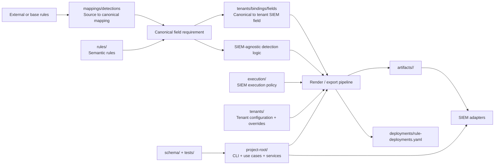

# Kiến trúc tổng quan dự án SIEM-Detection-as-Code

> English mirror: [project-architecture.md](../en/architecture/project-architecture.md)

## 1. Mục đích và phạm vi

Tài liệu này mô tả kiến trúc tổng quan của repository `SIEM-Detection-as-Code` trên cơ sở cấu trúc thư mục và hiện trạng source code đang có.

Mục đích của tài liệu là:

- xác định mô hình kiến trúc chuẩn để sử dụng trong các tài liệu tiếp theo
- chuẩn hóa cách hiểu giữa các thành phần `rules`, `mappings`, `execution`, `tenants`, `artifacts`, và `project-root`
- làm cơ sở tham chiếu cho việc phát triển, rà soát, và mở rộng repository

Tài liệu này tập trung vào kiến trúc logic và tổ chức dữ liệu. Các chi tiết implementation cụ thể có thể thay đổi theo tiến độ hoàn thiện của `project-root/`.

## 2. Mục tiêu hệ thống

`SIEM-Detection-as-Code` là repository triển khai mô hình `Detection as Code` với các mục tiêu sau:

- tách detection logic khỏi vendor log cụ thể
- tách detection logic khỏi SIEM implementation cụ thể
- quản lý detection rule như code
- hỗ trợ validate, render, export, và deploy rule theo tenant
- tăng khả năng tái sử dụng rule giữa nhiều tenant và nhiều nền tảng SIEM

Theo mô hình này, hệ thống được tổ chức thành các lớp riêng biệt cho:

- nội dung detection
- chuẩn hóa field và mapping
- cấu hình thực thi theo SIEM
- cấu hình tenant
- artifact đầu ra phục vụ export hoặc deploy
- application engine để đọc, validate, render, và điều phối quy trình

## 3. Mô hình kiến trúc

Kiến trúc hiện tại có thể được mô tả theo 4 trục chính.

### 3.1. Trục nội dung detection

Trục này quản lý detection content ở mức chuẩn và có khả năng tái sử dụng:

- `rules/`: semantic rules theo taxonomy chung
- `rules/detections/`: detection rule và detection base
- `rules/analysts/`: analyst rule chứa correlation hoặc logic tổng hợp, đồng thời mang `logsource` rõ ràng khi cần deploy hoặc render
- `mappings/detections/`: ánh xạ từ source rule field sang canonical field
- `tenants/.../bindings/fields/`: ánh xạ từ canonical field sang field thực tế trên SIEM của tenant

Mục tiêu của trục này là duy trì detection intent ổn định và giảm phụ thuộc trực tiếp vào naming hoặc parser của từng môi trường triển khai.

### 3.2. Trục cấu hình tenant

Trục này mô tả hiện trạng triển khai thực tế của từng tenant:

- `tenant.yaml`: định danh tenant, `siem_id`, và metadata vận hành
- `devices/`: thiết bị hoặc platform phát sinh log
- `logsources/`: dataset logic của từng device
- `bindings/ingest/`: ánh xạ `dataset_id` sang ingest target thực tế như `index`, `sourcetype`
- `bindings/fields/`: ánh xạ canonical field sang field thực tế trên SIEM
- `filters/`: tenant-specific filter áp dụng trong quá trình render
- `overrides/`: tenant-specific tuning cho execution hoặc hardcoded-query/filter logic
- `deployments/rule-deployments.yaml`: manifest bật hoặc tắt rule theo SIEM

Trục này trả lời các câu hỏi chính:

- tenant có những nguồn log nào
- dataset nào đang active
- dataset đó được ingest vào SIEM như thế nào
- rule nào được bật cho tenant
- filter hoặc tuning nào phải được áp khi render từ base rule

### 3.3. Trục thực thi theo SIEM

Trục này mô tả cách semantic rule được chạy trên một SIEM cụ thể:

- `execution/<siem>/defaults.yaml`: chính sách execution mặc định theo SIEM
- `execution/<siem>/rule-overrides.yaml`: override execution theo từng rule
- hardcoded query hoặc hardcoded SPL ở các nhánh đang triển khai thực tế

Mục tiêu của trục này là tách execution metadata khỏi semantic rule, nhưng vẫn cho phép vận hành trong giai đoạn converter tổng quát chưa hoàn thiện.

Chi tiết quan hệ trong execution layer được mô tả riêng tại [execution-relationship.md](./execution-relationship.md).

### 3.4. Trục vận hành và đầu ra

Trục này phục vụ validate, build, export, và deploy:

- `project-root/`: CLI, use cases, services, repositories, adapters
- `schema/`: contract dùng để validate rule và tenant config
- `tests/`: quality gate ở mức validator, smoke test, và cấu trúc thư mục
- `artifacts/`: output đã được render hoặc export cho từng tenant

Chi tiết 2 luồng render rule hiện tại được mô tả riêng tại [rule-rendering-flows.md](./rule-rendering-flows.md).

## 4. Sơ đồ kiến trúc tổng quan

## 5. Thành phần chính

### 5.1. `rules/`

`rules/` là nguồn lưu detection rule gốc của hệ thống.

Vai trò:

- lưu rule nền tảng theo taxonomy chung
- giữ detection logic ở mức tương đối độc lập với SIEM
- cung cấp đầu vào cho quá trình render tenant-specific rule

Về nguyên tắc kiến trúc, `rules/` là nguồn chuẩn của detection content; output trong `artifacts/` không thay thế vai trò này.

### 5.2. `mappings/`

`mappings/` là lớp chuẩn hóa field và ngữ nghĩa dữ liệu.

Vai trò:

- ánh xạ source rule field sang canonical field
- cung cấp vocabulary chung cho detection content
- tạo nền cho việc nối detection logic với field thực tế của tenant

Trong kiến trúc hiện tại, `mappings/detections/` là lớp mapping chuẩn ở phía content; `tenants/.../bindings/fields/` là lớp mapping triển khai theo tenant.

### 5.3. `execution/`

`execution/` là lớp cấu hình thực thi theo SIEM.

Vai trò:

- giữ execution metadata như schedule, earliest, latest, notable, severity, risk score
- giữ default policy theo từng SIEM
- giữ override theo từng rule mà không thay đổi semantic rule
- là lớp gần với implementation của SIEM hơn `rules/`, nhưng vẫn là input config chứ chưa phải output

Trong hiện trạng hiện nay, `execution/splunk/` là nhánh đang được hình thành rõ nhất.

### 5.4. `tenants/`

`tenants/` là lớp cấu hình đầu vào của từng tenant.

Vai trò:

- mô tả nguồn log, device, dataset, ingest binding, field binding, filter, override, và deployment manifest
- làm đầu vào trực tiếp cho quá trình render hoặc deploy
- phản ánh hiện trạng triển khai thực tế của từng tenant

Chi tiết quan hệ trong tenant layer được mô tả riêng tại [tenants-relationship.md](./tenants-relationship.md).

### 5.5. `artifacts/`

`artifacts/` là lớp output đã được materialize cho từng tenant.

Vai trò:

- lưu kết quả sau khi áp base rule, mapping, execution, filter, và deployment decision
- làm đầu ra phục vụ review, export, hoặc deploy

`artifacts/` là output của pipeline, không phải lớp cấu hình chuẩn để chỉnh tay dài hạn.

### 5.6. `project-root/`

`project-root/` là application engine của hệ thống.

Cấu trúc hiện tại cho thấy project đang được tổ chức theo hướng phân tầng:

- `interfaces/`: entrypoint cho CLI hoặc API
- `app/usecases/`: orchestration theo use case
- `app/services/`: application service
- `domain/models/`: domain model
- `domain/repositories/`: repository contract
- `infrastructure/repositories/`: repository đọc dữ liệu từ file
- `infrastructure/file_loader/`: loader cho YAML hoặc registry
- `infrastructure/siem/`: SIEM adapter
- `infrastructure/converter/`: converter layer

Hiện trạng này cho thấy repository không chỉ là kho YAML, mà đã có application layer phục vụ validate, render, export, và chuẩn bị deploy.

### 5.7. `schema/`

`schema/` là lớp contract để kiểm tra tính hợp lệ của file cấu hình và rule.

Vai trò:

- giảm lỗi cấu trúc file
- cung cấp chuẩn chung cho contributor và automation
- hỗ trợ validation trong CLI và test pipeline

### 5.8. `tests/`

`tests/` là quality gate cơ bản của hệ thống.

Vai trò:

- phát hiện sai lệch cấu trúc hoặc quan hệ dữ liệu
- kiểm tra validator, smoke flow, và deployment builder
- giảm nguy cơ regression khi thay đổi rule, mapping, hoặc tenant config

## 6. Luồng xử lý tổng quát

Pipeline kiến trúc hiện tại có thể được mô tả ngắn gọn như sau:

1. Nạp tenant config từ `tenants/<tenant>/`.
2. Xác định `tenant_id`, `siem_id`, danh sách device, và danh sách dataset.
3. Nạp semantic rules từ `rules/`.
4. Nạp detection mappings từ `mappings/detections/`.
5. Resolve ingest binding từ `tenants/.../bindings/ingest/`.
6. Resolve field binding từ `tenants/.../bindings/fields/`.
7. Resolve execution policy từ `execution/<siem>/`.
8. Áp tenant filters hoặc tenant overrides nếu có. Trong hardcoded-query flow hiện tại, `overrides/filter/` có thể override `search_query` trước bước tenant field mapping, nhưng deploy scope vẫn được xác định từ `rule.logsource`.
9. Đọc `deployments/rule-deployments.yaml` để chọn tập rule bật cho tenant.
10. Render output vào `artifacts/<tenant>/<siem-id>/`.
11. Nếu cần, dùng adapter trong `project-root/` để export hoặc deploy sang SIEM đích.

Chi tiết cách render theo từng mode được mô tả trong [rule-rendering-flows.md](./rule-rendering-flows.md).

## 7. Nguyên tắc kiến trúc

Các nguyên tắc sau phải được giữ nhất quán trong quá trình phát triển:

- detection logic không phụ thuộc trực tiếp vào vendor log
- detection logic không phụ thuộc trực tiếp vào SIEM implementation
- mapping, execution, tenant config, và deployment được tách thành các lớp riêng
- deployable output được sinh ra dưới dạng artifact, không phải nguồn chuẩn chính
- tenant configuration là đầu vào điều phối render và deploy
- validation và testing phải phát triển song song với rule content và configuration

## 8. Trạng thái hiện tại

Ở thời điểm hiện tại, mức độ trưởng thành của kiến trúc có thể chia thành 3 nhóm:

### 8.1. Thành phần đã hiện diện rõ

- tenant layer
- execution layer ở mức cơ bản
- rendered artifacts
- CLI / use case engine
- schema validation
- một phần mappings và SIEM adapters

### 8.2. Thành phần đã có khung nhưng chưa hoàn thiện đầy đủ

- rule view layer
- converter layer
- chuẩn hóa end-to-end giữa base rule và rendered rule
- chuẩn `filters/` và `overrides/` áp dụng nhất quán cho toàn bộ tenant

### 8.3. Định hướng mở rộng

- UI quản lý rule
- workflow hỗ trợ merge hoặc tuning
- hỗ trợ đa SIEM ở mức đầy đủ hơn
- pipeline build-deploy hoàn chỉnh theo tenant

## 9. Kết luận

Kiến trúc của `SIEM-Detection-as-Code` được tổ chức quanh 6 lớp chính:

- `rules/` giữ detection knowledge gốc
- `mappings/` giữ contract chuẩn hóa field và dữ liệu
- `execution/` giữ execution policy và SIEM-specific metadata
- `tenants/` giữ cấu hình triển khai thực tế của từng tenant
- `artifacts/` giữ output đã render
- `project-root/` giữ application engine để đọc, validate, render, và deploy

Các tài liệu chi tiết tiếp theo được xây dựng xoay quanh khối tenant, mapping, execution, và luồng render thực tế để hình thành bộ tài liệu chuẩn cho repository.
