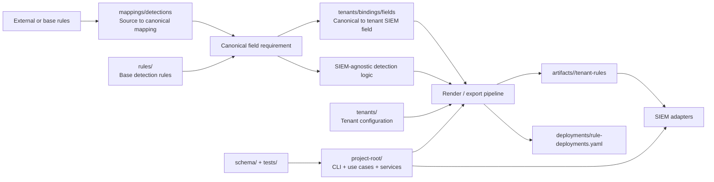
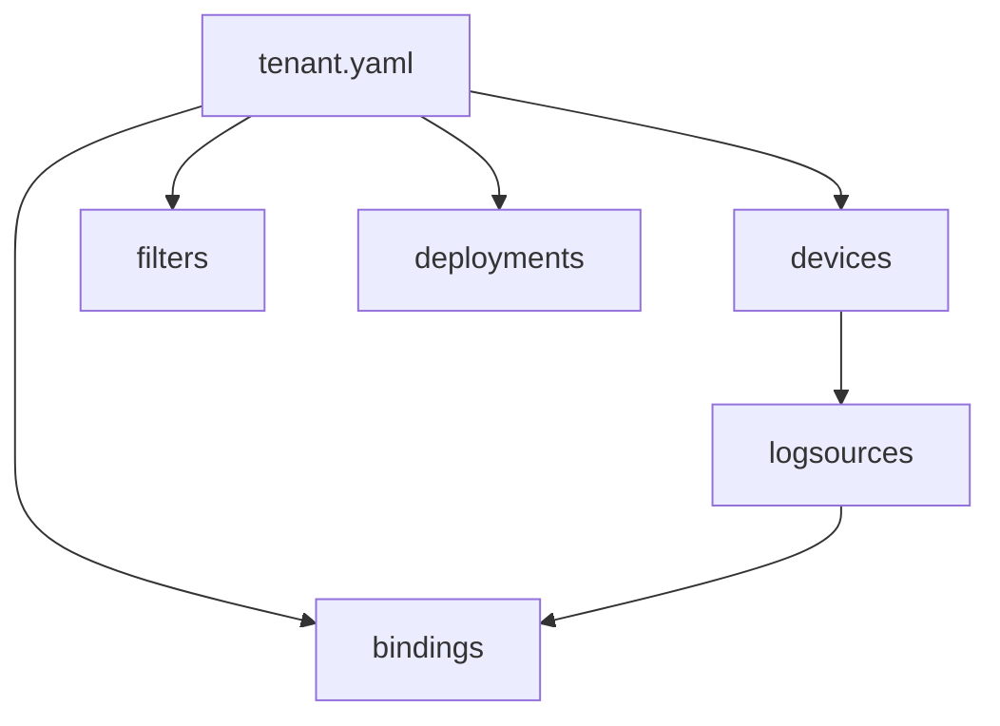
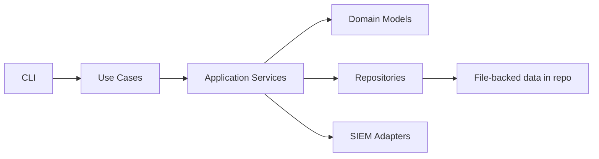

# Kiến trúc tổng quan dự án SIEM-DaC

## Mục đích tài liệu

Tài liệu này mô tả kiến trúc chung của toàn bộ project ở mức ý tưởng, nhưng vẫn bám theo cấu trúc source code và thư mục hiện tại của repository.

Đây là tài liệu khung để thống nhất cách nhìn về hệ thống. Một số phần đang được mô tả sơ bộ trước, đặc biệt là `tenants/`. Các phần khác sẽ được bổ sung chi tiết dần khi kiến trúc và implementation ổn định hơn.

## Mục tiêu của project

`SIEM-DaC` là repository phục vụ mô hình `Detection as Code`, với mục tiêu:

- tách logic detection khỏi vendor log cụ thể
- tách logic detection khỏi SIEM implementation cụ thể
- quản lý detection rule như code
- hỗ trợ build, validate, render, và deploy rule theo tenant
- tạo khả năng tái sử dụng rule giữa nhiều khách hàng / tenant / SIEM

Theo tinh thần từ `README.md`, hệ thống được thiết kế theo các lớp chính:

- nguồn log và chuẩn hóa dữ liệu
- detection rule độc lập SIEM
- lớp mapping / view / triển khai
- lớp cấu hình tenant
- lớp artifact đầu ra để deploy vào SIEM

## Góc nhìn kiến trúc

Có thể nhìn hệ thống theo 3 trục:

### 1. Trục nội dung detection

Trục này quản lý tri thức detection:

- `rules/`: rule gốc, theo category / product
- `mappings/detections/`: lớp ánh xạ từ source rule field sang canonical field theo domain
- `tenants/.../bindings/fields/`: lớp ánh xạ từ canonical field sang tenant SIEM field thực tế

Đây là phần "nội dung chuẩn" của hệ thống, có mục tiêu tái sử dụng và hạn chế phụ thuộc tenant cụ thể.

### 2. Trục cấu hình tenant

Trục này mô tả môi trường thực tế của từng tenant:

- `tenants/`: tenant config, devices, logsources, bindings, filters, deployments

Đây là phần giúp quyết định:

- tenant có những nguồn log nào
- dataset nào đang active
- dataset đó vào SIEM bằng `index` / `sourcetype` nào
- rule nào được enable cho tenant
- filter nào cần áp khi render từ base rule

### 3. Trục vận hành và đầu ra

Trục này phục vụ quá trình validate, build, export, deploy:

- `project-root/`: CLI, use cases, services, repositories, adapters
- `schema/`: JSON schema để validate rule và tenant config
- `tests/`: test cho validator, folder structure, deployment builder
- `artifacts/`: kết quả render / export dành riêng cho từng tenant

Đây là phần "engine" và "output" của hệ thống.

## Sơ đồ kiến trúc tổng quan



## 1. `rules/` - Base detection rules

Đây là nơi lưu detection rule gốc của hệ thống.

Vai trò:

- lưu rule nền tảng theo category / product
- giữ detection logic ở mức tương đối độc lập với SIEM
- làm nguồn đầu vào cho quá trình render sang tenant-specific rules

Hiện trạng:

- đang có cấu trúc như `rules/detections/...`
- có cả rule theo category chung và rule theo product / base

Trong ý tưởng dài hạn:

- rule ở đây nên là nguồn chuẩn
- rule tenant trong `artifacts/` chỉ nên là kết quả build, không phải nơi chỉnh tay chính

## 2. `mappings/` - Mapping layer

Thư mục `mappings/` là lớp nối giữa detection logic, logsource vendor, và SIEM thực tế.

Các nhánh chính được định hướng là:

- `mappings/detections/`
- `tenants/.../bindings/fields/`

### `mappings/detections/`

Vai trò:

- ánh xạ field của rule nguồn sang canonical field của project
- được tổ chức song song với taxonomy của `rules/`
- ưu tiên shared field dictionary theo domain thay vì 1 file mapping cho từng rule
- metadata trong file mapping nên dùng cùng field với `rule.logsource`, tức là `category`, `product`, `service`

Ví dụ đề xuất:

- `mappings/detections/network/firewall/firewall.fields.yml`

### `tenants/.../bindings/fields/`

Vai trò:

- là lớp ánh xạ từ canonical field sang field thực tế của từng tenant trên SIEM
- phản ánh khác biệt theo tenant, device, dataset, và SIEM thực tế

Trong kiến trúc ý tưởng:

- `detections` giúp ingest rule từ nhiều nguồn field vocabulary khác nhau
- `bindings/fields` giúp nối canonical field với field set thực tế của tenant

## 3. `tenants/` - Tenant configuration layer

`tenants/` là lớp cấu hình đầu vào cho từng tenant.

Đây là phần hiện đã có cấu trúc tương đối rõ và là thành phần cần được mô tả sơ bộ đầu tiên trong kiến trúc tổng thể.

### Cấu trúc ý tưởng

```text
tenants/
  <tenant_name>/
    tenant.yaml
    devices/
      *.yaml
    logsources/
      *.yaml
    bindings/
      ingest/
        *.yaml
      fields/
        *.yml
    filters/
      detections/
        <category>/
          <product>/
            *.yaml
    deployments/
      rule-deployments.yaml
```

### Vai trò của từng nhóm file

`tenant.yaml`

- định danh tenant
- xác định `siem_id`
- lưu metadata và default setting của tenant

`devices/`

- mô tả tài sản hoặc platform phát sinh log
- định danh bằng `device_id`

`logsources/`

- mô tả các dataset logic của từng `device_id`
- chưa gắn chặt với ingest thực tế của SIEM

`bindings/`

- `bindings/ingest/` ánh xạ `dataset_id` sang `index` / `sourcetype` hoặc cấu hình ingest thực tế trên SIEM
- `bindings/fields/` ánh xạ canonical field sang field thực tế của tenant trên SIEM

`filters/`

- là lớp `tenant rule filter`
- được dùng khi render từ base rule sang rule áp dụng cho tenant
- cho phép thêm ngoại lệ, giới hạn, hoặc điều kiện riêng theo tenant

`deployments/rule-deployments.yaml`

- lưu quyết định enable / disable rule theo từng SIEM
- là manifest phục vụ render và deploy

### Quan hệ sơ bộ trong tenant layer



### Vai trò của `tenants/` trong toàn hệ thống

`tenants/` là điểm nối giữa:

- rule chuẩn của hệ thống
- mapping chuẩn của hệ thống
- hiện trạng nguồn log thực tế của khách hàng / tenant

Nói cách khác:

- `rules/` trả lời "nên phát hiện hành vi gì?"
- `mappings/` trả lời "dữ liệu và field được hiểu như thế nào?"
- `tenants/` trả lời "tenant này thực sự có gì và deploy cái gì?"

Chi tiết hơn về tenant layer đã được ghi riêng trong:

- [tenants-relationship.md](./tenants-relationship.md)
- [mappings-relationship.md](./mappings-relationship.md)

## 4. `artifacts/` - Rendered output layer

`artifacts/` là nơi chứa kết quả đầu ra dành riêng cho từng tenant.

Ví dụ hiện tại:

- `artifacts/fis/tenant-rules/...`

Vai trò:

- lưu rule đã được materialize cho tenant
- phản ánh kết quả sau khi áp:
  - base rule
  - mapping
  - tenant filter
  - deployment decision

Về nguyên tắc kiến trúc:

- `artifacts/` là output
- `artifacts/` không phải nguồn cấu hình chuẩn để chỉnh tay lâu dài

## 5. `project-root/` - Application engine

`project-root/` là phần code thực thi của hệ thống.

Hiện trạng code cho thấy project đang theo hướng phân tầng tương đối rõ:

- `interfaces/`: CLI / API entrypoint
- `app/usecases/`: use case orchestration
- `app/services/`: nghiệp vụ mức ứng dụng
- `domain/models/`: model nghiệp vụ
- `domain/repositories/`: contract repository
- `infrastructure/repositories/`: repository đọc file
- `infrastructure/file_loader/`: YAML / registry loader
- `infrastructure/siem/`: adapter triển khai theo SIEM
- `infrastructure/converter/`: converter layer

### Luồng code hiện tại



### Các use case đã thấy trong code

- `load-tenant`
- `export-rules`
- `deploy-rules`
- `validate-tenant`
- `validate-rules`

Ý nghĩa kiến trúc:

- project không chỉ là kho YAML
- project đã có engine để đọc cấu hình, build deployment payload, validate, và chuẩn bị deploy

## 6. `schema/` - Validation contract

`schema/` là lớp contract để kiểm tra định dạng file.

Hiện có:

- schema cho tenant objects
- schema cho rule objects

Vai trò:

- giảm lỗi cấu trúc file
- tạo chuẩn chung cho contributor và automation
- hỗ trợ validation trong CLI / test pipeline

## 7. `tests/` - Quality gate

`tests/` giữ vai trò kiểm tra cơ bản cho hệ thống.

Hiện đã có các hướng kiểm thử như:

- validate tenant config
- smoke test
- rule deployment builder
- folder architecture

Trong kiến trúc mục tiêu, đây là lớp đảm bảo:

- thay đổi mapping không phá render
- thay đổi tenant config không phá quan hệ chéo
- rule output giữ tính nhất quán

## Luồng nghiệp vụ tổng quát

Ở mức ý tưởng, pipeline chung của project là:

1. Nạp tenant config từ `tenants/<tenant>/`.
2. Xác định tenant đang dùng SIEM nào và có những nguồn log nào.
3. Nạp base rules từ `rules/`.
4. Nạp mapping từ `mappings/detections/` và `tenants/.../bindings/fields/`.
5. Áp tenant bindings và tenant filters.
6. Quyết định tập rule khả dụng theo `deployments/rule-deployments.yaml`.
7. Render rule đầu ra theo tenant.
8. Ghi output vào `artifacts/<tenant>/tenant-rules/`.
9. Nếu cần, dùng SIEM adapter để deploy rule sang nền tảng đích.

## Nguyên tắc thiết kế chung

Từ `README.md`, tài liệu cũ, và cấu trúc hiện tại, các nguyên tắc thiết kế nên được giữ nhất quán là:

- detection logic không phụ thuộc vendor log trực tiếp
- detection logic không phụ thuộc SIEM trực tiếp
- mapping, tenant config, và deployment được tách thành lớp riêng
- output deployable là artifact được sinh ra, không phải source of truth chính
- cấu hình tenant là đầu vào điều phối việc render và deploy
- validation và test phải đi cùng cấu hình và rule content

## Trạng thái hiện tại của kiến trúc

Nhìn theo project hiện tại, có thể chia thành 3 mức trưởng thành:

### Mức đã hiện diện rõ

- tenant layer
- rendered artifacts
- CLI / use case engine
- schema validation
- một phần mappings và SIEM adapter

### Mức đã có khung nhưng chưa hoàn thiện đầy đủ

- rule view layer
- converter layer
- chuẩn hóa end-to-end giữa base rule và rendered rule
- chuẩn `filters/` cho toàn bộ tenant

### Mức định hướng tương lai

- UI quản lý rule
- auto merge / auto tuning workflow
- triển khai đa SIEM đầy đủ
- pipeline build-deploy hoàn chỉnh theo tenant

## Kết luận

Kiến trúc tổng quan của project có thể hiểu ngắn gọn như sau:

- `rules/` giữ detection knowledge gốc
- `mappings/` giữ lớp chuẩn hóa dữ liệu và field
- `tenants/` giữ cấu hình thực tế của từng tenant
- `project-root/` là engine đọc, validate, render, và deploy
- `artifacts/` giữ output rule đã render cho tenant
- `schema/` và `tests/` giữ vai trò quality gate

Ở thời điểm hiện tại, phần `tenants/` là khối đã nhìn thấy rõ nhất về quan hệ dữ liệu, nên được mô tả trước trong tài liệu tổng quan này. Các phần còn lại có thể được mở rộng thành tài liệu riêng ở các bước tiếp theo.
