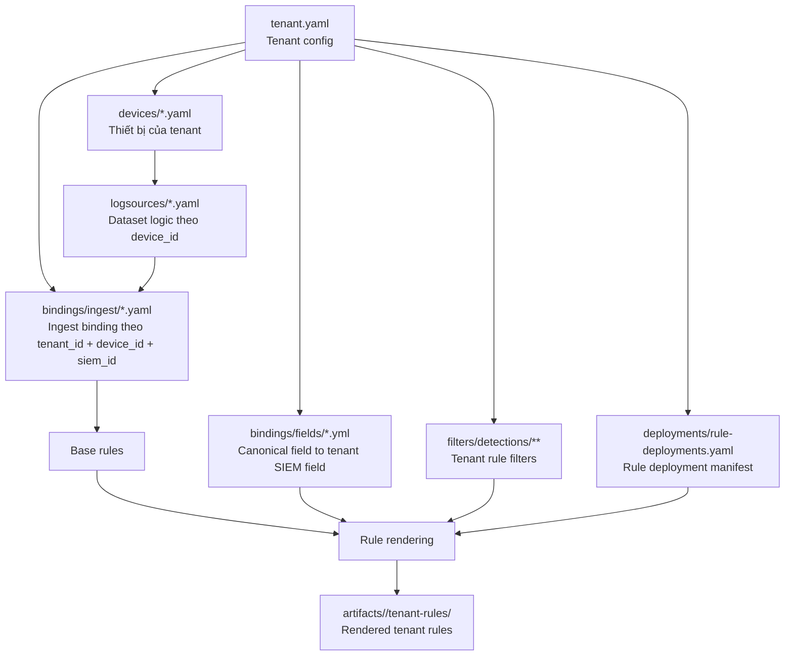

# Kiến trúc thành phần Tenant

## Phạm vi

Tài liệu này chuẩn hóa quan hệ giữa các thành phần trong thư mục `tenants/`, dựa trên cấu trúc đang có của tenant `fis` và mô hình render rule của dự án.

Mục tiêu của thư mục `tenants/` là lưu cấu hình đặc thù cho từng tenant để hệ thống có thể:

- xác định nguồn log tenant đang có
- ánh xạ nguồn log đó vào SIEM thực tế
- chọn rule nào được áp dụng cho tenant
- áp tenant-specific filter khi render từ base rule
- sinh rule đầu ra vào `artifacts/<tenant>/tenant-rules/`

## Cấu trúc chuẩn

```text
tenants/
  <tenant_name>/
    tenant.yaml
    devices/
      *.yaml
    logsources/
      *.yaml
    bindings/
      ingest/
        *.yaml
      fields/
        *.yml
    filters/
      detections/
        <category>/
          <product>/
            *.yaml
    deployments/
      rule-deployments.yaml
```

Trong tenant `fis` hiện đang có các nhóm file sau:

- `tenant.yaml`
- `devices/*.yaml`
- `logsources/*.yaml`
- `bindings/ingest/*.yaml`
- `bindings/fields/*.yml`
- `deployments/rule-deployments.yaml`

Hiện trạng dữ liệu của `fis`:

- `1` tenant config
- `11` device definitions
- `11` logsource definitions
- `11` ingest binding definitions
- `1` field binding definition
- `1` deployment manifest

## Sơ đồ quan hệ



## Quan hệ giữa các thành phần

### 1. `tenant.yaml` là nút gốc của tenant

File này chứa định danh và cấu hình SIEM mặc định của tenant, ví dụ:

- `tenant_id`
- `name`
- `environment`
- `timezone`
- `siem_id`
- `default_index`
- metadata vận hành như `owner`, `contact`, `criticality`

Vai trò:

- định danh tenant
- khai báo tenant đang chạy trên SIEM nào
- cung cấp ngữ cảnh chung cho toàn bộ thành phần bên dưới

Quan hệ:

- `tenant.yaml` 1-n `devices`
- `tenant.yaml` 1-n `bindings`
- `tenant.yaml` 1-n `filters`
- `tenant.yaml` 1-1 `deployments/rule-deployments.yaml`

### 2. `devices/*.yaml` mô tả tài sản hoặc platform phát sinh log

Mỗi file device thuộc về một tenant qua `tenant_id` và được định danh bằng `device_id`.

Ví dụ trong `fis`:

- `device_eset_ra.yaml` có `device_id: eset-ra`
- `device_checkpoint_fw.yaml` có `device_id: checkpoint-fw`

Vai trò:

- mô tả loại thiết bị hoặc product
- khai báo `device_type`, `vendor`, `product`, `role`, `functions`
- làm điểm neo để nối sang `logsource`

Quan hệ:

- `tenant` 1-n `device`
- một `device_id` tương ứng với một file `logsource_*`

### 3. `logsources/*.yaml` mô tả dataset logic của từng device

Mỗi file logsource tham chiếu tới `device_id` và định nghĩa các `dataset_id` mà device đó tạo ra.

Ví dụ:

- `logsource_eset_ra.yaml` định nghĩa dataset `eset-ra-alerts`
- `logsource_barracuda_waf.yaml` định nghĩa các dataset `api`, `app`, `system`

Vai trò:

- mô tả lớp dữ liệu logic, chưa gắn với ingest cụ thể trên SIEM
- lưu metadata như `category`, `log_type`, `description`, `enabled`

Quan hệ:

- `device` 1-1 `logsource file`
- `logsource file` 1-n `dataset`

### 4. `bindings/ingest/*.yaml` ánh xạ dataset logic vào SIEM thực tế

Ingest binding là lớp nối giữa dữ liệu logic trong `logsource` và dữ liệu ingest thực tế trên SIEM.

Mỗi binding dùng các khóa:

- `tenant_id`
- `device_id`
- `siem_id`

Mỗi dataset trong binding sẽ map sang:

- `index`
- `sourcetype`

Ví dụ `bindings/ingest/binding_eset_ra.yaml`:

- `dataset_id: eset-ra-alerts`
- `index: epav`
- `sourcetype: eset:ra`

Ý nghĩa:

- `logsource` trả lời câu hỏi "device này có dataset nào?"
- `ingest binding` trả lời câu hỏi "dataset đó nằm ở đâu trên SIEM?"

Quan hệ:

- `tenant` 1-n `binding`
- `ingest binding` gắn với đúng một `device_id`
- `ingest binding.dataset_id` phải khớp với `logsource.dataset_id`
- `ingest binding.siem_id` phải khớp với `tenant.yaml.siem_id` khi render cho SIEM hiện hành

### 5. `bindings/fields/*.yml` ánh xạ canonical field sang field thực tế của tenant

Field binding là lớp mô tả cách canonical field của detection content được gắn vào field thực tế trên SIEM của tenant.

Mỗi file field binding có thể dùng các khóa:

- `tenant_id`
- `siem_id`
- `device_id`
- `dataset_id`

Mỗi field binding sẽ map:

- `canonical field`
- sang `tenant SIEM field`

Ví dụ `bindings/fields/checkpoint-fw.fields.yml`:

- `canonical.source.ip: src_ip`
- `canonical.destination.port: service`
- `canonical.network.protocol: proto`

Ý nghĩa:

- `mappings/detections/.../*.fields.yml` trả lời câu hỏi "field của rule nguồn tương ứng với canonical field nào?"
- `bindings/fields/*.yml` trả lời câu hỏi "canonical field đó hiện đang là field nào trên SIEM của tenant?"

Quan hệ:

- `tenant` 1-n `field binding`
- `field binding` có thể gắn với `device_id` hoặc `dataset_id`
- `field binding.siem_id` phải khớp với `tenant.yaml.siem_id` khi render cho SIEM hiện hành

### 6. `filters/` là tenant rule filter dùng khi render từ base rule

`filters/` là lớp filter đặc thù theo tenant. Đây không phải nguồn log và cũng không phải rule đầu ra; nó là input của quá trình render rule.

Cấu trúc chuẩn:

```text
filters/
  detections/
    <category>/
      <product>/
        *.yaml
```

Vai trò:

- giới hạn hoặc tinh chỉnh logic của base rule theo đặc thù tenant
- cho phép áp ngoại lệ, whitelist, điều kiện môi trường, hoặc ràng buộc theo nguồn log
- giúp dùng lại `base rule` mà không phải fork rule riêng cho từng tenant

Quan hệ:

- `filters` tham gia vào bước render rule
- `filters` thường được tra cứu theo `category`, `product`, hoặc tập nguồn log tương ứng
- đầu ra sau khi áp filter sẽ được ghi vào `artifacts/<tenant>/tenant-rules/`

### 7. `deployments/rule-deployments.yaml` quyết định rule nào được bật cho tenant

File này lưu danh sách rule theo từng SIEM trong khóa `rule_deployments_by_siem`.

Ví dụ hiện tại:

- tenant `fis`
- SIEM `splunk`
- mỗi rule có `rule_id`, `enabled`, `display_name`

Vai trò:

- là manifest triển khai rule cho tenant
- tách quyết định enable/disable ra khỏi định nghĩa nguồn log
- là đầu vào để chọn tập rule được render hoặc triển khai

Quan hệ:

- `tenant.yaml.siem_id` chọn nhánh phù hợp trong `rule_deployments_by_siem`
- chỉ các rule được bật mới đi tiếp vào pipeline render/deploy

## Khóa liên kết chính

Toàn bộ mô hình hiện tại xoay quanh 4 khóa chính:

| Khóa | Xuất hiện ở đâu | Ý nghĩa |
| --- | --- | --- |
| `tenant_id` | `tenant.yaml`, `devices`, `bindings`, `deployments` | định danh tenant |
| `device_id` | `devices`, `logsources`, `bindings` | định danh nguồn log hoặc platform |
| `dataset_id` | `logsources`, `bindings` | định danh dataset logic của device |
| `siem_id` | `tenant.yaml`, `bindings`, `deployments` | định danh SIEM đích |

## Luồng xử lý chuẩn

Luồng dữ liệu hợp lý của hệ thống là:

1. Đọc `tenant.yaml` để xác định `tenant_id`, `siem_id`, và cấu hình chung.
2. Đọc `devices/*.yaml` để lấy danh sách device thuộc tenant.
3. Với từng `device_id`, đọc `logsources/*.yaml` để biết device phát ra các dataset nào.
4. Dùng `bindings/ingest/*.yaml` để ánh xạ từng `dataset_id` sang `index` và `sourcetype` trên SIEM tương ứng.
5. Dùng `bindings/fields/*.yml` để ánh xạ canonical field sang field thực tế của tenant trên SIEM.
6. Đọc `deployments/rule-deployments.yaml` để lấy danh sách rule bật/tắt theo `siem_id`.
7. Nạp `filters/` để áp tenant-specific filter lên base rule trong quá trình render.
7. Kết hợp:
   - base rules
   - ingest bindings đã resolve ra `index` và `sourcetype`
   - field bindings đã resolve canonical field ra tenant SIEM field
   - tenant rule filters
   - trạng thái enable/disable trong deployments
8. Sinh rule đầu ra vào `artifacts/<tenant>/tenant-rules/`.

## Ví dụ trace end-to-end

Ví dụ với `eset-ra`:

1. `devices/device_eset_ra.yaml`
   - khai báo đây là endpoint security product của tenant `fis`
2. `logsources/logsource_eset_ra.yaml`
   - khai báo dataset `eset-ra-alerts`
3. `bindings/ingest/binding_eset_ra.yaml`
   - map `eset-ra-alerts` sang `index: epav`, `sourcetype: eset:ra` trên `splunk`
4. `bindings/fields/*.yml`
   - nếu có, map canonical field của rule sang field thực tế của tenant
5. `filters/detections/...`
   - nếu có, sẽ bổ sung điều kiện hoặc ngoại lệ riêng cho tenant khi render base rule
6. `deployments/rule-deployments.yaml`
   - quyết định rule nào cho `splunk` được bật
7. Kết quả render xuất hiện trong:
   - `artifacts/fis/tenant-rules/...`

## Phân biệt `tenants/` và `artifacts/`

- `tenants/` là lớp cấu hình đầu vào theo tenant
- `filters/` trong `tenants/` là input filter để render rule
- `artifacts/<tenant>/tenant-rules/` là lớp kết quả đã được render cho tenant

Nói ngắn gọn:

- `tenants/` chứa cấu hình và chính sách render
- `artifacts/` chứa rule đầu ra sau khi áp mapping, filter, và deployment decision

## Kết luận

Quan hệ cốt lõi trong kiến trúc tenant là:

- `tenant` sở hữu `devices`
- mỗi `device` có `logsource`
- `ingest binding` nối `logsource dataset` với SIEM ingestion thực tế
- `field binding` nối canonical field với field thực tế của tenant trên SIEM
- `filters` tinh chỉnh base rule cho tenant trong lúc render
- `deployment` quyết định rule nào được phép đi tiếp
- đầu ra cuối cùng được materialize trong `artifacts/<tenant>/tenant-rules`
