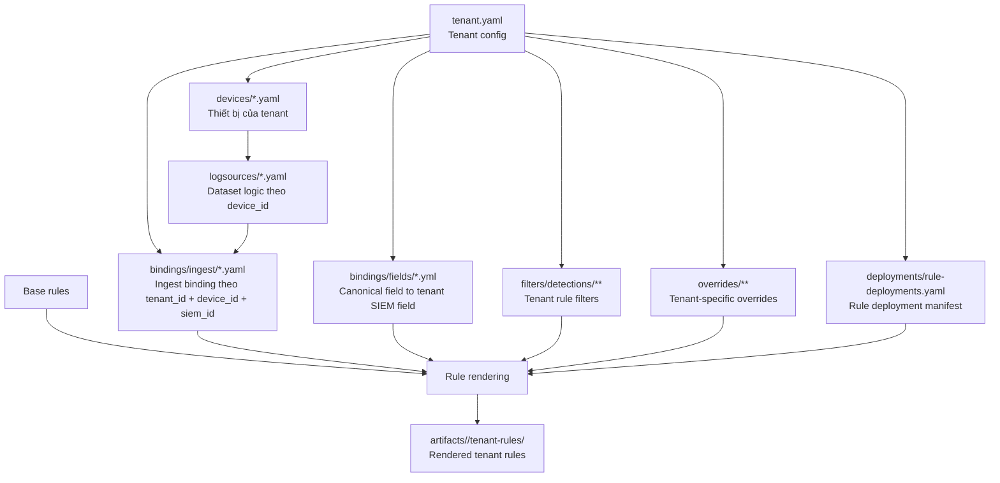

# Kiến trúc thành phần Tenant

> English mirror: [tenants-relationship.md](../en/architecture/tenants-relationship.md)

## 1. Mục đích và phạm vi

Tài liệu này xác định cấu trúc chuẩn và quan hệ dữ liệu của thư mục `tenants/` trong repository `SIEM-Detection-as-Code`.

Phạm vi của tài liệu bao gồm:

- cấu trúc thư mục chuẩn của một tenant
- vai trò của từng nhóm file trong tenant layer
- các khóa liên kết chính giữa các đối tượng dữ liệu
- luồng xử lý chuẩn từ tenant configuration đến output render

Tài liệu này sử dụng tenant `lab` như một ví dụ tham chiếu cho trạng thái dữ liệu hiện tại, nhưng nội dung áp dụng cho mô hình tenant nói chung.

## 2. Mục tiêu của tenant layer

`tenants/` là lớp cấu hình đầu vào theo tenant. Lớp này được sử dụng để:

- xác định nguồn log hiện có của tenant
- mô tả device và dataset logic thuộc tenant
- ánh xạ dataset vào mô hình ingest thực tế trên SIEM
- ánh xạ canonical field sang field thực tế trên SIEM
- áp filter đặc thù theo tenant trong quá trình render
- áp override execution hoặc tenant-specific tuning trong quá trình vận hành
- xác định tập rule được bật hoặc tắt theo tenant và SIEM
- sinh output vào `artifacts/<tenant>/tenant-rules/`

## 3. Cấu trúc chuẩn

```text
tenants/
  <tenant_name>/
    tenant.yaml
    devices/
      *.yaml
    logsources/
      *.yaml
    bindings/
      ingest/
        *.yaml
      fields/
        *.yml
    overrides/
      execution/
        <siem>/
          ...
      filter/
        detections/
          ...
        analysts/
          ...
    filters/
      detections/
        <category>/
          <product>/
            *.yaml
    deployments/
      rule-deployments.yaml
```

Trong tenant `lab`, các nhóm file hiện có bao gồm:

- `tenant.yaml`
- `devices/*.yaml`
- `logsources/*.yaml`
- `bindings/ingest/*.yaml`
- `bindings/fields/*.yml`
- `overrides/execution/**`
- `overrides/filter/**`
- `deployments/rule-deployments.yaml`

Hiện trạng dữ liệu của `lab` tại thời điểm ghi tài liệu:

- `1` tenant config
- `11` device definitions
- `11` logsource definitions
- `11` ingest binding definitions
- `1` field binding definition
- `1` deployment manifest

## 4. Sơ đồ quan hệ



## 5. Thành phần dữ liệu

### 5.1. `tenant.yaml`

`tenant.yaml` là đối tượng gốc của tenant.

Nội dung điển hình:

- `tenant_id`
- `name`
- `environment`
- `timezone`
- `siem_id`
- `default_index`
- metadata vận hành như `owner`, `contact`, `criticality`

Vai trò:

- định danh tenant
- xác định tenant đang sử dụng SIEM nào
- cung cấp ngữ cảnh chung cho các thành phần bên dưới

Quan hệ:

- `tenant.yaml` 1-n `devices`
- `tenant.yaml` 1-n `bindings`
- `tenant.yaml` 1-n `filters`
- `tenant.yaml` 1-n `overrides`
- `tenant.yaml` 1-1 `deployments/rule-deployments.yaml`

### 5.2. `devices/*.yaml`

Mỗi file device thuộc về một tenant thông qua `tenant_id` và được định danh bằng `device_id`.

Ví dụ trong `lab`:

- `device_eset_ra.yaml` có `device_id: eset-ra`
- `device_checkpoint_fw.yaml` có `device_id: checkpoint-fw`

Vai trò:

- mô tả thiết bị hoặc product phát sinh log
- khai báo `device_type`, `vendor`, `product`, `role`, `functions`
- làm điểm neo để nối sang `logsource`

Quan hệ:

- `tenant` 1-n `device`
- một `device_id` tương ứng với một `logsource_*`

### 5.3. `logsources/*.yaml`

Mỗi file logsource tham chiếu tới `device_id` và định nghĩa các `dataset_id` do device đó tạo ra.

Ví dụ:

- `logsource_eset_ra.yaml` định nghĩa dataset `eset-ra-alerts`
- `logsource_barracuda_waf.yaml` định nghĩa các dataset `api`, `app`, `system`

Vai trò:

- mô tả lớp dữ liệu logic trước khi ánh xạ vào ingest thực tế
- lưu metadata như `category`, `log_type`, `description`, `enabled`

Quan hệ:

- `device` 1-1 `logsource file`
- `logsource file` 1-n `dataset`

### 5.4. `bindings/ingest/*.yaml`

Ingest binding là lớp ánh xạ dataset logic vào ingest model thực tế của SIEM.

Mỗi binding sử dụng các khóa sau:

- `tenant_id`
- `device_id`
- `siem_id`

Mỗi dataset trong binding sẽ ánh xạ sang các giá trị như:

- `index`
- `sourcetype`

Ví dụ `bindings/ingest/binding_eset_ra.yaml`:

- `dataset_id: eset-ra-alerts`
- `index: epav`
- `sourcetype: eset:ra`

Vai trò:

- nối `logsource.dataset_id` với ingest target thực tế trên SIEM
- cung cấp thông tin cần thiết để render hoặc deploy rule cho tenant

Quan hệ:

- `tenant` 1-n `binding`
- `ingest binding` gắn với đúng một `device_id`
- `ingest binding.dataset_id` phải khớp với `logsource.dataset_id`
- `ingest binding.siem_id` phải khớp với `tenant.yaml.siem_id` cho target đang render

### 5.5. `bindings/fields/*.yml`

Field binding là lớp ánh xạ canonical field sang field thực tế của tenant trên SIEM.

Mỗi file field binding có thể dùng các khóa như:

- `tenant_id`
- `siem_id`
- `device_id`
- `dataset_id`

Mỗi field binding mô tả:

- canonical field nào được sử dụng
- field tương ứng trên SIEM của tenant là gì

Ví dụ `bindings/fields/checkpoint-fw.fields.yml`:

- `canonical.source.ip: src_ip`
- `canonical.destination.port: service`
- `canonical.network.protocol: proto`

Vai trò:

- nhận đầu vào từ lớp canonical field
- cung cấp field thực tế để rule có thể render hoặc deploy đúng theo tenant

Quan hệ:

- `tenant` 1-n `field binding`
- `field binding` có thể được scope theo `device_id` hoặc `dataset_id`
- `field binding.siem_id` phải khớp với `tenant.yaml.siem_id` cho target đang render

### 5.6. `filters/`

`filters/` là lớp tenant rule filter được áp trong quá trình render.

Cấu trúc chuẩn:

```text
filters/
  detections/
    <category>/
      <product>/
        *.yaml
```

Vai trò:

- giới hạn hoặc tinh chỉnh logic của base rule theo đặc thù tenant
- áp ngoại lệ, whitelist, điều kiện môi trường, hoặc ràng buộc theo nguồn log
- cho phép tái sử dụng `base rule` mà không cần fork rule riêng cho từng tenant

Quan hệ:

- `filters` tham gia trực tiếp vào bước render rule
- `filters` thường được tra cứu theo `category`, `product`, hoặc tập nguồn log tương ứng
- output sau khi áp filter được ghi vào `artifacts/<tenant>/tenant-rules/`

### 5.7. `overrides/`

`overrides/` là lớp tenant-specific tuning được áp trong quá trình render.

Vai trò:

- điều chỉnh execution metadata cho riêng tenant như schedule, severity, risk score
- bổ sung tenant-specific filter logic mà không phải fork semantic rule gốc
- hỗ trợ tuning trong quá trình vận hành SOC theo tenant

Nguyên tắc:

- tenant override chỉ nên chứa phần delta so với rule gốc hoặc execution config gốc
- tenant override là lớp cuối cùng trong quá trình tuning
- tenant override không thay thế vai trò của `deployments/rule-deployments.yaml`

Chi tiết vai trò của override file được mô tả thêm trong [execution-relationship.md](./execution-relationship.md) và [rule-rendering-flows.md](./rule-rendering-flows.md).

### 5.8. `deployments/rule-deployments.yaml`

File này lưu quyết định bật hoặc tắt rule theo từng SIEM trong khóa `rule_deployments_by_siem`.

Ví dụ hiện tại:

- tenant `lab`
- SIEM `splunk`
- mỗi rule có `rule_id`, `enabled`, `display_name`

Vai trò:

- là manifest triển khai rule cho tenant
- tách quyết định enable hoặc disable khỏi định nghĩa nguồn log
- cung cấp tập rule đầu vào cho render hoặc deploy

Quan hệ:

- `tenant.yaml.siem_id` chọn nhánh phù hợp trong `rule_deployments_by_siem`
- chỉ các rule được bật mới đi tiếp vào pipeline render hoặc deploy

## 6. Khóa liên kết chính

Toàn bộ tenant model hiện tại xoay quanh 4 khóa chính:

| Khóa | Xuất hiện ở đâu | Ý nghĩa |
| --- | --- | --- |
| `tenant_id` | `tenant.yaml`, `devices`, `bindings`, `deployments`, `overrides` | định danh tenant |
| `device_id` | `devices`, `logsources`, `bindings` | định danh nguồn log hoặc platform |
| `dataset_id` | `logsources`, `bindings` | định danh dataset logic của device |
| `siem_id` | `tenant.yaml`, `bindings`, `deployments`, `overrides/execution` | định danh SIEM đích |

## 7. Trình tự xử lý chuẩn

Trình tự xử lý chuẩn của tenant layer được mô tả như sau:

1. Đọc `tenant.yaml` để xác định `tenant_id`, `siem_id`, và cấu hình chung.
2. Đọc `devices/*.yaml` để lấy danh sách device thuộc tenant.
3. Với từng `device_id`, đọc `logsources/*.yaml` để xác định các dataset tương ứng.
4. Resolve `bindings/ingest/*.yaml` để ánh xạ `dataset_id` sang `index` và `sourcetype` trên target SIEM.
5. Resolve `bindings/fields/*.yml` để ánh xạ canonical field sang field thực tế của tenant.
6. Đọc `deployments/rule-deployments.yaml` để lấy trạng thái bật hoặc tắt rule theo `siem_id`.
7. Nạp `filters/` và `overrides/` để áp tenant-specific filter hoặc tenant-specific tuning trong quá trình render.
8. Kết hợp base rules, ingest bindings, field bindings, tenant filters, tenant overrides, và deployment decision.
9. Sinh output vào `artifacts/<tenant>/tenant-rules/`.

## 8. Ví dụ luồng dữ liệu tham chiếu

Ví dụ với `eset-ra`:

1. `devices/device_eset_ra.yaml` khai báo đây là endpoint security product của tenant `lab`.
2. `logsources/logsource_eset_ra.yaml` khai báo dataset `eset-ra-alerts`.
3. `bindings/ingest/binding_eset_ra.yaml` ánh xạ `eset-ra-alerts` sang `index: epav` và `sourcetype: eset:ra` trên `splunk`.
4. `bindings/fields/*.yml`, nếu có, ánh xạ canonical field của rule sang field thực tế của tenant.
5. `filters/detections/...`, nếu có, bổ sung điều kiện hoặc ngoại lệ riêng cho tenant trong lúc render.
6. `overrides/execution/...`, nếu có, điều chỉnh metadata thực thi riêng cho tenant.
7. `deployments/rule-deployments.yaml` quyết định rule nào được bật cho `splunk`.
8. Kết quả render được ghi vào `artifacts/lab/tenant-rules/...`.

## 9. Phân biệt `tenants/` và `artifacts/`

- `tenants/` là lớp cấu hình đầu vào theo tenant
- `filters/` trong `tenants/` là input dùng trong quá trình render
- `overrides/` trong `tenants/` là input tuning dùng trong quá trình render
- `artifacts/<tenant>/tenant-rules/` là lớp output đã được render cho tenant

Diễn giải ở mức kiến trúc:

- `tenants/` chứa cấu hình và chính sách render
- `artifacts/` chứa kết quả sau khi áp mapping, filter, execution, và deployment decision

## 10. Kết luận

Trong kiến trúc hiện tại:

- `tenant` sở hữu `devices`
- mỗi `device` có `logsource`
- `ingest binding` nối `logsource dataset` với ingest model thực tế trên SIEM
- `field binding` nối canonical field với field thực tế của tenant
- `filters` tinh chỉnh base rule trong lúc render
- `overrides` tinh chỉnh execution hoặc logic theo tenant trong lúc render
- `deployment` quyết định rule nào được đi tiếp
- output cuối cùng được materialize trong `artifacts/<tenant>/tenant-rules`

Tài liệu này là chuẩn tham chiếu cho mọi thay đổi liên quan đến cấu trúc tenant, tenant binding, và cơ chế render theo tenant trong repository.
