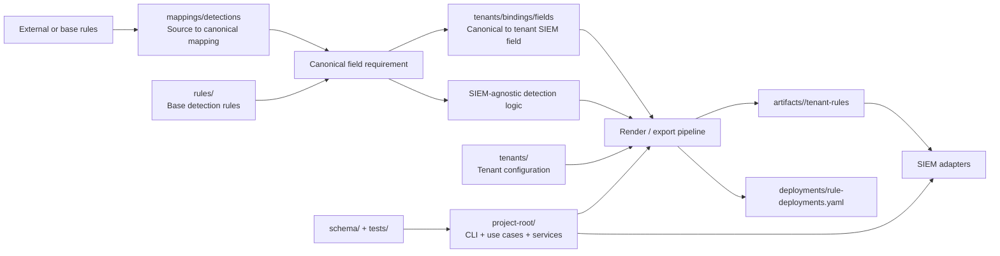

# SIEM-Detection-as-Code Project Architecture Overview

> Vietnamese source: [project-architecture.md](../../architecture/project-architecture.md)

## 1. Purpose and Scope

This document defines the high-level architecture of the `SIEM-Detection-as-Code` repository based on the current directory structure and the current state of the source code.

Its purpose is to:

- define the standard architectural model used by the rest of the documentation set
- standardize how `rules`, `mappings`, `tenants`, `artifacts`, and `project-root` are understood
- provide a stable reference for future development, review, and extension of the repository

This document focuses on logical architecture and data organization. Implementation details may continue to evolve while `project-root/` is being completed.

## 2. System Objectives

`SIEM-Detection-as-Code` implements a `Detection as Code` operating model with the following objectives:

- separate detection logic from vendor-specific log formats
- separate detection logic from SIEM-specific implementation
- manage detection rules as code
- support validation, rendering, export, and deployment per tenant
- improve rule reuse across multiple tenants and SIEM platforms

Under this model, the system is separated into dedicated layers for:

- detection content
- field normalization and mapping
- tenant configuration
- output artifacts used for export or deployment
- an application engine that reads, validates, renders, and coordinates the process

## 3. Architectural Model

The current architecture can be described through 3 primary axes.

### 3.1. Detection Content Axis

This axis manages reusable detection content:

- `rules/`: base detection rules by category and product
- `mappings/detections/`: mappings from source rule fields to canonical fields
- `tenants/.../bindings/fields/`: mappings from canonical fields to actual tenant SIEM fields

The purpose of this axis is to preserve stable detection intent while reducing direct dependency on parser output or field naming in a specific environment.

### 3.2. Tenant Configuration Axis

This axis describes the effective deployment state of each tenant:

- `tenant.yaml`: tenant identity, `siem_id`, and operational metadata
- `devices/`: devices or platforms that generate logs
- `logsources/`: logical datasets for each device
- `bindings/ingest/`: mappings from `dataset_id` to actual ingestion targets such as `index` and `sourcetype`
- `bindings/fields/`: mappings from canonical fields to actual SIEM fields
- `filters/`: tenant-specific filters applied during rendering
- `deployments/rule-deployments.yaml`: manifest that enables or disables rules by SIEM

This axis answers the following questions:

- which log sources a tenant has
- which datasets are active
- how those datasets are ingested into the SIEM
- which rules are enabled for the tenant
- which filters must be applied when rendering from base rules

### 3.3. Operations and Output Axis

This axis supports validation, build, export, and deployment:

- `project-root/`: CLI, use cases, services, repositories, adapters
- `schema/`: contracts used to validate rules and tenant configuration
- `tests/`: quality gates such as validators, smoke tests, and structure checks
- `artifacts/`: rendered or exported output for each tenant

## 4. High-Level Architecture Diagram

## 5. Main Components

### 5.1. `rules/`

`rules/` stores the source detection rules of the system.

Role:

- store foundational rules under a shared taxonomy
- preserve detection logic at a level that is relatively independent from SIEM implementation
- provide the input used to render tenant-specific rules

Architecturally, `rules/` is the source of truth for detection content; output under `artifacts/` does not replace that role.

### 5.2. `mappings/`

`mappings/` is the normalization layer for fields and data semantics.

Role:

- map source rule fields to canonical fields
- provide a shared vocabulary for detection content
- establish the basis for connecting detection logic to actual tenant fields

In the current architecture, `mappings/detections/` is the standard mapping layer on the content side; `tenants/.../bindings/fields/` is the tenant-specific implementation layer.

### 5.3. `tenants/`

`tenants/` is the tenant input configuration layer.

Role:

- describe log sources, devices, datasets, ingest bindings, field bindings, filters, and deployment manifests
- serve as direct input for rendering and deployment
- reflect the actual deployment state of each tenant

Detailed tenant-layer relationships are specified in [tenants-relationship.md](./tenants-relationship.md).

### 5.4. `artifacts/`

`artifacts/` is the materialized output layer for each tenant.

Role:

- store the result after applying base rules, mappings, filters, and deployment decisions
- provide output for review, export, or deployment

`artifacts/` is pipeline output and should not be treated as the long-term hand-edited configuration layer.

### 5.5. `project-root/`

`project-root/` is the application engine of the system.

Its current structure indicates a layered implementation approach:

- `interfaces/`: CLI or API entrypoints
- `app/usecases/`: orchestration by use case
- `app/services/`: application services
- `domain/models/`: domain models
- `domain/repositories/`: repository contracts
- `infrastructure/repositories/`: file-backed repositories
- `infrastructure/file_loader/`: loaders for YAML or registries
- `infrastructure/siem/`: SIEM adapters
- `infrastructure/converter/`: converter layer

This shows that the repository is not only a YAML content store; it already includes an application layer for validation, rendering, export, and deployment preparation.

### 5.6. `schema/`

`schema/` is the contract layer used to validate the structure of rule and configuration files.

Role:

- reduce structural file errors
- provide a shared contract for contributors and automation
- support validation in the CLI and test pipeline

### 5.7. `tests/`

`tests/` is the baseline quality gate of the system.

Role:

- detect structure and relationship inconsistencies
- verify validators, smoke flows, and deployment builders
- reduce regression risk when rules, mappings, or tenant configuration change

## 6. High-Level Processing Flow

The current architectural pipeline can be described as follows:

1. Load tenant configuration from `tenants/<tenant>/`.
2. Resolve `tenant_id`, `siem_id`, device inventory, and dataset inventory.
3. Load base rules from `rules/`.
4. Load detection mappings from `mappings/detections/`.
5. Resolve ingest bindings from `tenants/.../bindings/ingest/`.
6. Resolve field bindings from `tenants/.../bindings/fields/`.
7. Apply tenant filters from `tenants/.../filters/`.
8. Read `deployments/rule-deployments.yaml` to determine which rules are enabled for the tenant.
9. Render output into `artifacts/<tenant>/tenant-rules/`.
10. If required, use adapters in `project-root/` to export or deploy to the target SIEM.

## 7. Architectural Principles

The following principles must remain consistent throughout future development:

- detection logic must not depend directly on vendor log formats
- detection logic must not depend directly on SIEM implementation
- mapping, tenant configuration, and deployment must remain separate layers
- deployable output must be generated as an artifact rather than treated as the primary source of truth
- tenant configuration must drive rendering and deployment
- validation and testing must evolve together with rule content and configuration

## 8. Current State

At the current stage, architecture maturity can be grouped into 3 categories.

### 8.1. Components that are clearly present

- tenant layer
- rendered artifacts
- CLI / use case engine
- schema validation
- parts of mappings and SIEM adapters

### 8.2. Components that exist as a framework but are not yet complete

- rule view layer
- converter layer
- end-to-end normalization between base rules and rendered rules
- a consistent tenant-wide `filters/` standard

### 8.3. Extension direction

- rule management UI
- merge or tuning workflows
- broader multi-SIEM support
- a complete per-tenant build-and-deploy pipeline

## 9. Conclusion

The architecture of `SIEM-Detection-as-Code` is organized around 5 primary layers:

- `rules/` stores source detection knowledge
- `mappings/` stores the normalization contract for fields and data
- `tenants/` stores the actual deployment configuration of each tenant
- `artifacts/` stores rendered output
- `project-root/` stores the application engine used to read, validate, render, and deploy

At the current stage, `tenants/` is the most structurally explicit and stable data layer. The more detailed documentation set is therefore built around the tenant layer and the mapping layer as the basis for a long-term standard architecture reference.
