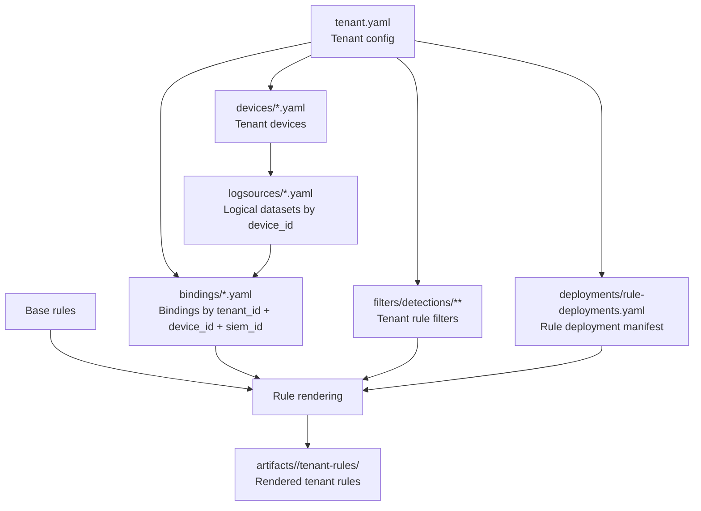

# Tenant Component Architecture

## Scope

This document standardizes the relationships between components inside the `tenants/` directory, based on the current `fis` tenant structure and the project's rule rendering model.

The purpose of `tenants/` is to store tenant-specific configuration so the system can:

- identify the tenant's available log sources
- map those log sources to the actual SIEM ingestion model
- decide which rules apply to the tenant
- apply tenant-specific rule filters when rendering from base rules
- generate output rules in `artifacts/<tenant>/tenant-rules/`

## Standard structure

```text
tenants/
  <tenant_name>/
    tenant.yaml
    devices/
      *.yaml
    logsources/
      *.yaml
    bindings/
      *.yaml
    filters/
      detections/
        <category>/
          <product>/
            *.yaml
    deployments/
      rule-deployments.yaml
```

The current `fis` tenant contains these file groups:

- `tenant.yaml`
- `devices/*.yaml`
- `logsources/*.yaml`
- `bindings/*.yaml`
- `deployments/rule-deployments.yaml`

Current `fis` data shape:

- `1` tenant config
- `11` device definitions
- `11` logsource definitions
- `11` binding definitions
- `1` deployment manifest

## Relationship diagram



## Component relationships

### 1. `tenant.yaml` is the root tenant object

This file stores the tenant identity and its default SIEM configuration, for example:

- `tenant_id`
- `name`
- `environment`
- `timezone`
- `siem_id`
- `default_index`
- operational metadata such as `owner`, `contact`, `criticality`

Responsibilities:

- identify the tenant
- declare which SIEM the tenant uses
- provide shared context for downstream components

Relationships:

- `tenant.yaml` 1-n `devices`
- `tenant.yaml` 1-n `bindings`
- `tenant.yaml` 1-n `filters`
- `tenant.yaml` 1-1 `deployments/rule-deployments.yaml`

### 2. `devices/*.yaml` describes tenant assets or log-emitting platforms

Each device file belongs to a tenant through `tenant_id` and is identified by `device_id`.

Examples from `fis`:

- `device_eset_ra.yaml` has `device_id: eset-ra`
- `device_checkpoint_fw.yaml` has `device_id: checkpoint-fw`

Responsibilities:

- describe the device type or product
- declare `device_type`, `vendor`, `product`, `role`, and `functions`
- provide the anchor for matching to `logsource`

Relationships:

- `tenant` 1-n `device`
- one `device_id` maps to one `logsource_*` file

### 3. `logsources/*.yaml` defines the logical datasets for each device

Each logsource file references a `device_id` and defines the `dataset_id` values produced by that device.

Examples:

- `logsource_eset_ra.yaml` defines `eset-ra-alerts`
- `logsource_barracuda_waf.yaml` defines `api`, `app`, and `system`

Responsibilities:

- define the logical data layer before SIEM-specific ingestion mapping
- store metadata such as `category`, `log_type`, `description`, and `enabled`

Relationships:

- `device` 1-1 `logsource file`
- `logsource file` 1-n `dataset`

### 4. `bindings/*.yaml` maps logical datasets to the real SIEM ingestion model

Bindings connect the logical data defined in `logsource` to the actual representation used by the SIEM.

Each binding uses these keys:

- `tenant_id`
- `device_id`
- `siem_id`

Each dataset entry maps to:

- `index`
- `sourcetype`

Example from `binding_eset_ra.yaml`:

- `dataset_id: eset-ra-alerts`
- `index: epav`
- `sourcetype: eset:ra`

Meaning:

- `logsource` answers "which datasets does this device produce?"
- `binding` answers "where does that dataset live in the SIEM?"

Relationships:

- `tenant` 1-n `binding`
- each `binding` belongs to exactly one `device_id`
- `binding.dataset_id` must match `logsource.dataset_id`
- `binding.siem_id` must match `tenant.yaml.siem_id` for the active render target

### 5. `filters/` is the tenant rule filter layer used during base rule rendering

`filters/` is a tenant-specific filtering layer. It is neither a log source definition nor a rendered rule output; it is an input to the rule rendering pipeline.

Standard structure:

```text
filters/
  detections/
    <category>/
      <product>/
        *.yaml
```

Responsibilities:

- constrain or refine base rule logic for a specific tenant
- support exceptions, allowlists, environmental conditions, or source-specific conditions
- allow reuse of base rules without forking separate rules per tenant

Relationships:

- `filters` participates in the rule rendering stage
- `filters` is typically resolved by `category`, `product`, or the corresponding source set
- the filtered output is written to `artifacts/<tenant>/tenant-rules/`

### 6. `deployments/rule-deployments.yaml` decides which rules are enabled for the tenant

This file stores rule deployment decisions by SIEM under `rule_deployments_by_siem`.

Current example:

- tenant `fis`
- SIEM `splunk`
- each rule has `rule_id`, `enabled`, and `display_name`

Responsibilities:

- serve as the tenant's rule deployment manifest
- separate enable/disable decisions from log source definitions
- provide the selection input for render and deployment

Relationships:

- `tenant.yaml.siem_id` selects the relevant branch in `rule_deployments_by_siem`
- only enabled rules should continue through the render/deploy pipeline

## Main linkage keys

The current model is centered around four main keys:

| Key | Appears in | Meaning |
| --- | --- | --- |
| `tenant_id` | `tenant.yaml`, `devices`, `bindings`, `deployments` | tenant identity |
| `device_id` | `devices`, `logsources`, `bindings` | log source or platform identity |
| `dataset_id` | `logsources`, `bindings` | logical dataset identity for a device |
| `siem_id` | `tenant.yaml`, `bindings`, `deployments` | target SIEM identity |

## Standard processing flow

The expected system flow is:

1. Read `tenant.yaml` to determine `tenant_id`, `siem_id`, and shared configuration.
2. Read `devices/*.yaml` to collect the tenant's devices.
3. For each `device_id`, read `logsources/*.yaml` to identify the datasets produced by that device.
4. Use `bindings/*.yaml` to map each `dataset_id` to the appropriate `index` and `sourcetype` in the target SIEM.
5. Read `deployments/rule-deployments.yaml` to get rule enable/disable decisions for the active `siem_id`.
6. Load `filters/` to apply tenant-specific filters to base rules during rendering.
7. Combine:
   - base rules
   - SIEM-resolved bindings
   - tenant rule filters
   - deployment decisions
8. Generate rendered rules in `artifacts/<tenant>/tenant-rules/`.

## End-to-end example

Example for `eset-ra`:

1. `devices/device_eset_ra.yaml`
   - declares this endpoint security product for tenant `fis`
2. `logsources/logsource_eset_ra.yaml`
   - defines dataset `eset-ra-alerts`
3. `bindings/binding_eset_ra.yaml`
   - maps `eset-ra-alerts` to `index: epav`, `sourcetype: eset:ra` on `splunk`
4. `filters/detections/...`
   - if present, adds tenant-specific conditions or exceptions during base rule rendering
5. `deployments/rule-deployments.yaml`
   - decides which `splunk` rules are enabled
6. The rendered output appears under:
   - `artifacts/fis/tenant-rules/...`

## `tenants/` vs `artifacts/`

- `tenants/` is the tenant input configuration layer
- `filters/` inside `tenants/` is an input filtering layer used during rendering
- `artifacts/<tenant>/tenant-rules/` is the rendered output layer

In short:

- `tenants/` stores configuration and rendering policy
- `artifacts/` stores rules after mapping, filtering, and deployment decisions are applied

## Conclusion

The core relationship in the tenant architecture is:

- `tenant` owns `devices`
- each `device` has a `logsource`
- `binding` connects `logsource datasets` to real SIEM ingestion fields
- `filters` refines base rules for a specific tenant during rendering
- `deployment` decides which rules are allowed to continue
- the final output is materialized in `artifacts/<tenant>/tenant-rules/`
