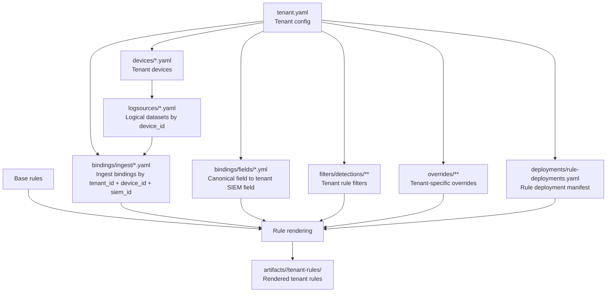

# Tenant Component Architecture

> Vietnamese source: [tenants-relationship.md](../../architecture/tenants-relationship.md)

## 1. Purpose and Scope

This document defines the standard structure and data relationships of the `tenants/` directory in the `SIEM-Detection-as-Code` repository.

Its scope includes:

- the standard folder structure of a tenant
- the role of each file group in the tenant layer
- the main linkage keys between tenant objects
- the standard processing flow from tenant configuration to rendered output

This document uses tenant `lab` as a reference example for the current data state, but the model applies to the tenant layer in general.

## 2. Objectives of the Tenant Layer

`tenants/` is the tenant-specific input configuration layer. It is used to:

- identify the log sources currently available for a tenant
- describe devices and logical datasets owned by the tenant
- map datasets to the actual SIEM ingestion model
- map canonical fields to actual SIEM fields
- apply tenant-specific filters during rendering
- apply execution overrides or tenant-specific tuning during operation
- determine which rules are enabled or disabled by tenant and SIEM
- generate output under `artifacts/<tenant>/tenant-rules/`

## 3. Standard Structure

```text
tenants/
  <tenant_name>/
    tenant.yaml
    devices/
      *.yaml
    logsources/
      *.yaml
    bindings/
      ingest/
        *.yaml
      fields/
        *.yml
    overrides/
      execution/
        <siem>/
          ...
      filter/
        detections/
          ...
        analysts/
          ...
    filters/
      detections/
        <category>/
          <product>/
            *.yaml
    deployments/
      rule-deployments.yaml
```

In tenant `lab`, the current file groups are:

- `tenant.yaml`
- `devices/*.yaml`
- `logsources/*.yaml`
- `bindings/ingest/*.yaml`
- `bindings/fields/*.yml`
- `overrides/execution/**`
- `overrides/filter/**`
- `deployments/rule-deployments.yaml`

Current data snapshot of `lab` at the time of writing:

- `1` tenant config
- `11` device definitions
- `11` logsource definitions
- `11` ingest binding definitions
- `1` field binding definition
- `1` deployment manifest

## 4. Relationship Diagram



## 5. Data Components

### 5.1. `tenant.yaml`

`tenant.yaml` is the root object of a tenant.

Typical content:

- `tenant_id`
- `name`
- `environment`
- `timezone`
- `siem_id`
- `default_index`
- operational metadata such as `owner`, `contact`, and `criticality`

Role:

- identify the tenant
- define which SIEM the tenant uses
- provide shared context for downstream components

Relationships:

- `tenant.yaml` 1-n `devices`
- `tenant.yaml` 1-n `bindings`
- `tenant.yaml` 1-n `filters`
- `tenant.yaml` 1-n `overrides`
- `tenant.yaml` 1-1 `deployments/rule-deployments.yaml`

### 5.2. `devices/*.yaml`

Each device file belongs to a tenant through `tenant_id` and is identified by `device_id`.

Examples in `lab`:

- `device_eset_ra.yaml` has `device_id: eset-ra`
- `device_checkpoint_fw.yaml` has `device_id: checkpoint-fw`

Role:

- describe the device or product that generates logs
- declare `device_type`, `vendor`, `product`, `role`, and `functions`
- serve as the anchor point to `logsource`

Relationships:

- `tenant` 1-n `device`
- one `device_id` corresponds to one `logsource_*`

### 5.3. `logsources/*.yaml`

Each logsource file references a `device_id` and defines the `dataset_id` values generated by that device.

Examples:

- `logsource_eset_ra.yaml` defines dataset `eset-ra-alerts`
- `logsource_barracuda_waf.yaml` defines datasets `api`, `app`, and `system`

Role:

- describe the logical data layer prior to actual SIEM ingestion mapping
- store metadata such as `category`, `log_type`, `description`, and `enabled`

Relationships:

- `device` 1-1 `logsource file`
- `logsource file` 1-n `dataset`

### 5.4. `bindings/ingest/*.yaml`

An ingest binding maps logical datasets to the actual SIEM ingestion model.

Each binding uses the following keys:

- `tenant_id`
- `device_id`
- `siem_id`

Each dataset in the binding maps to values such as:

- `index`
- `sourcetype`

Example `bindings/ingest/binding_eset_ra.yaml`:

- `dataset_id: eset-ra-alerts`
- `index: epav`
- `sourcetype: eset:ra`

Role:

- connect `logsource.dataset_id` with the actual ingestion target in the SIEM
- provide the information required to render or deploy rules for the tenant

Relationships:

- `tenant` 1-n `binding`
- an `ingest binding` belongs to exactly one `device_id`
- `ingest binding.dataset_id` must match `logsource.dataset_id`
- `ingest binding.siem_id` must match `tenant.yaml.siem_id` for the active render target

### 5.5. `bindings/fields/*.yml`

A field binding maps canonical fields to the tenant's actual SIEM fields.

Each field binding file may use keys such as:

- `tenant_id`
- `siem_id`
- `device_id`
- `dataset_id`

Each field binding describes:

- which canonical field is used
- which actual SIEM field corresponds to it for the tenant

Example `bindings/fields/checkpoint-fw.fields.yml`:

- `canonical.source.ip: src_ip`
- `canonical.destination.port: service`
- `canonical.network.protocol: proto`

Role:

- receive input from the canonical field layer
- provide the actual fields required for correct tenant-specific rendering or deployment

Relationships:

- `tenant` 1-n `field binding`
- a `field binding` may be scoped by `device_id` or `dataset_id`
- `field binding.siem_id` must match `tenant.yaml.siem_id` for the active render target

### 5.6. `filters/`

`filters/` is the tenant rule-filter layer applied during rendering.

Standard structure:

```text
filters/
  detections/
    <category>/
      <product>/
        *.yaml
```

Role:

- constrain or refine base-rule logic according to tenant-specific characteristics
- apply exceptions, allowlists, environment conditions, or source constraints
- allow reuse of a base rule without maintaining a separate fork per tenant

Relationships:

- `filters` participates directly in the rendering step
- `filters` is typically resolved by `category`, `product`, or the relevant source set
- output after applying filters is written to `artifacts/<tenant>/tenant-rules/`

### 5.7. `overrides/`

`overrides/` is the tenant-specific tuning layer applied during rendering.

Role:

- adjust execution metadata for a specific tenant, such as schedule, severity, or risk score
- add tenant-specific filter logic without forking the original semantic rule
- support operational SOC tuning at the tenant level

Principles:

- tenant overrides should contain only the delta from the base rule or base execution configuration
- tenant overrides are the final tuning layer in the render process
- tenant overrides do not replace the role of `deployments/rule-deployments.yaml`

Additional detail on override behavior is described in [execution-relationship.md](./execution-relationship.md) and in the Vietnamese rendering-flow reference [rule-rendering-flows.md](../../architecture/rule-rendering-flows.md).

### 5.8. `deployments/rule-deployments.yaml`

This file stores rule enable or disable decisions by SIEM under `rule_deployments_by_siem`.

Current example:

- tenant `lab`
- SIEM `splunk`
- each rule includes `rule_id`, `enabled`, and `display_name`

Role:

- serve as the rule deployment manifest for the tenant
- separate enable or disable decisions from source definitions
- provide the rule set used for rendering or deployment

Relationships:

- `tenant.yaml.siem_id` selects the relevant branch in `rule_deployments_by_siem`
- only enabled rules continue into the render or deploy pipeline

## 6. Main Linkage Keys

The current tenant model revolves around 4 primary keys:

| Key | Appears in | Meaning |
| --- | --- | --- |
| `tenant_id` | `tenant.yaml`, `devices`, `bindings`, `deployments`, `overrides` | tenant identifier |
| `device_id` | `devices`, `logsources`, `bindings` | log-source or platform identifier |
| `dataset_id` | `logsources`, `bindings` | logical dataset identifier for a device |
| `siem_id` | `tenant.yaml`, `bindings`, `deployments`, `overrides/execution` | target SIEM identifier |

## 7. Standard Processing Sequence

The standard processing sequence of the tenant layer is as follows:

1. Read `tenant.yaml` to determine `tenant_id`, `siem_id`, and common configuration.
2. Read `devices/*.yaml` to collect the tenant's devices.
3. For each `device_id`, read `logsources/*.yaml` to determine the related datasets.
4. Resolve `bindings/ingest/*.yaml` to map each `dataset_id` to `index` and `sourcetype` on the target SIEM.
5. Resolve `bindings/fields/*.yml` to map canonical fields to the tenant's actual fields.
6. Read `deployments/rule-deployments.yaml` to obtain rule enable or disable decisions by `siem_id`.
7. Load `filters/` and `overrides/` to apply tenant-specific filters or tenant-specific tuning during rendering.
8. Combine base rules, ingest bindings, field bindings, tenant filters, tenant overrides, and deployment decisions.
9. Generate output under `artifacts/<tenant>/tenant-rules/`.

## 8. Reference Data-Flow Example

Example using `eset-ra`:

1. `devices/device_eset_ra.yaml` declares this endpoint security product for tenant `lab`.
2. `logsources/logsource_eset_ra.yaml` declares dataset `eset-ra-alerts`.
3. `bindings/ingest/binding_eset_ra.yaml` maps `eset-ra-alerts` to `index: epav` and `sourcetype: eset:ra` on `splunk`.
4. `bindings/fields/*.yml`, if present, maps the rule's canonical fields to tenant-specific fields.
5. `filters/detections/...`, if present, adds tenant-specific conditions or exceptions during rendering.
6. `overrides/execution/...`, if present, adjusts tenant-specific execution metadata.
7. `deployments/rule-deployments.yaml` determines which rules are enabled for `splunk`.
8. The rendered output is written to `artifacts/lab/tenant-rules/...`.

## 9. Distinction Between `tenants/` and `artifacts/`

- `tenants/` is the tenant input-configuration layer
- `filters/` under `tenants/` is input used during rendering
- `overrides/` under `tenants/` is tuning input used during rendering
- `artifacts/<tenant>/tenant-rules/` is the output layer already rendered for the tenant

In summary:

- `tenants/` stores configuration and rendering policy
- `artifacts/` stores the result after applying mappings, filters, execution, and deployment decisions

## 10. Conclusion

In the current architecture:

- a tenant owns `devices`
- each `device` has a `logsource`
- an ingest binding connects a logsource dataset to the actual SIEM ingestion model
- a field binding connects canonical fields to tenant-specific fields
- `filters` refine base rules during rendering
- `overrides` tune execution or logic during rendering
- `deployment` determines which rules are allowed to continue
- the final output is materialized under `artifacts/<tenant>/tenant-rules`

This document is the normative reference for all changes related to tenant structure, tenant bindings, and tenant-driven rendering in the repository.
